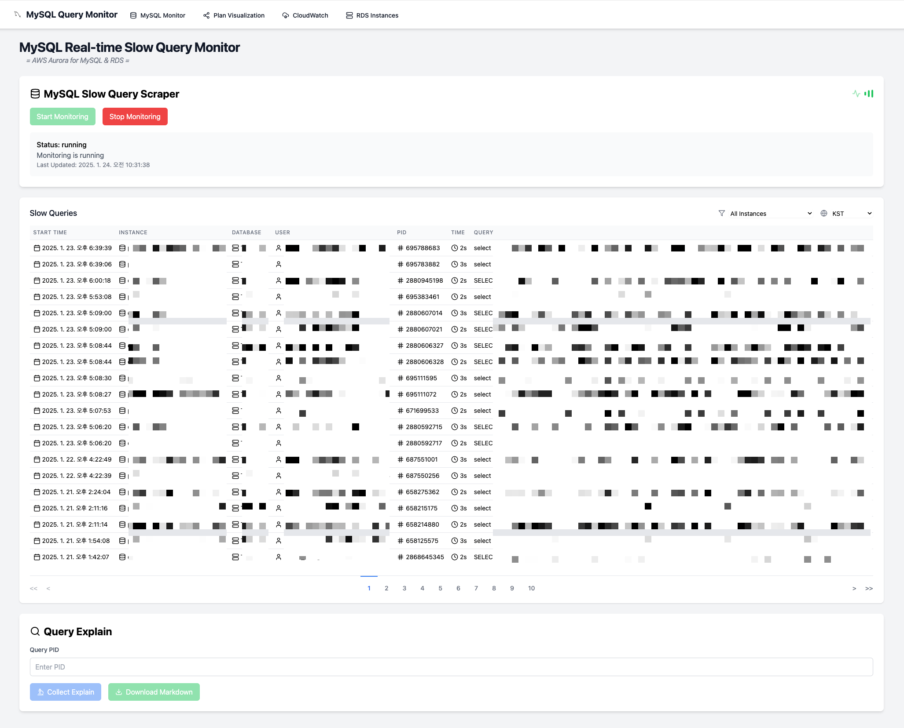
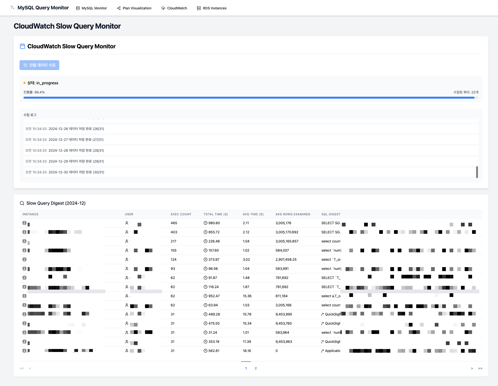
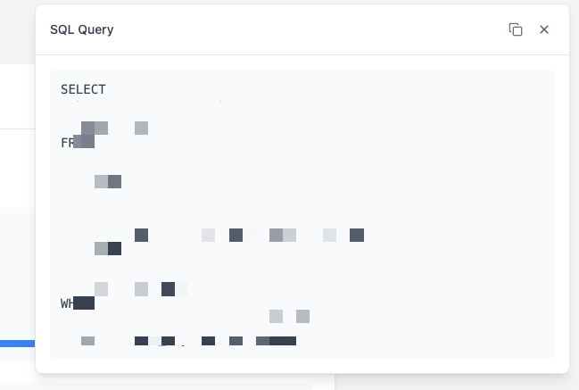
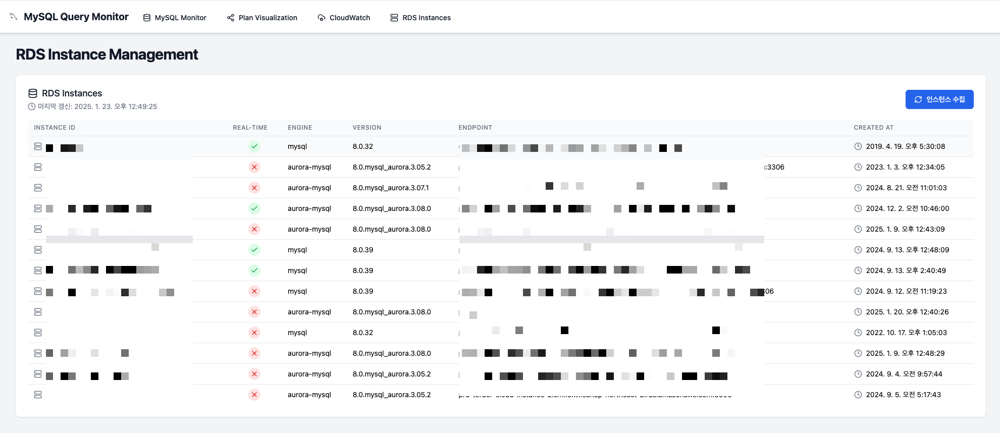
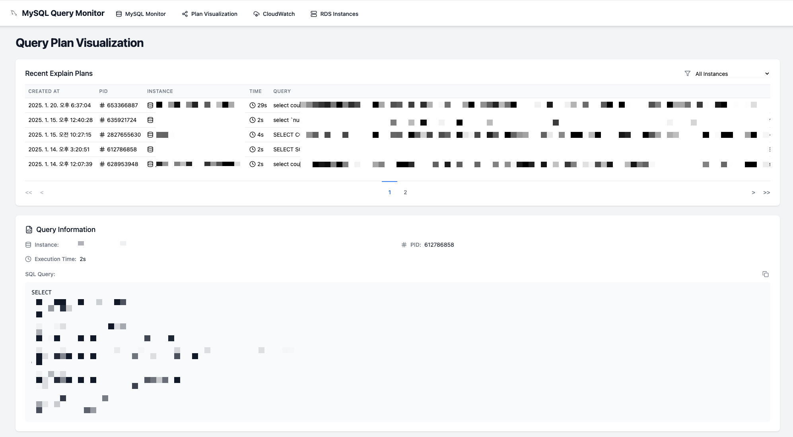
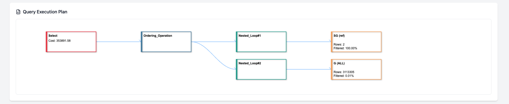
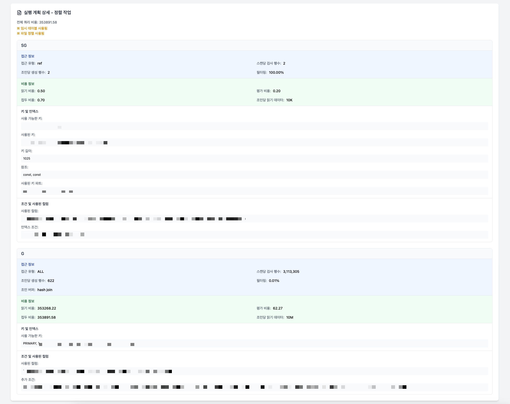

# CloudWatch Slow Query Dashboard

CloudWatch Slow Query Dashboard는 AWS RDS 인스턴스들의 슬로우 쿼리를 수집하고 모니터링하는 웹 애플리케이션입니다.
- [my_slow_query_scraper](https://github.com/TeiNam/my_slow_query_scraper)의 백엔드 API의 정보를 대시보드로 구현합니다.
- AWS 다중계정은 지원하지 않습니다.
- AWS 멀티리전은 레이턴시 문제로 지원하지 않습니다. 따라서 하나의 리전에서만 사용해야 합니다.
- VPC간의 피어링이 되어 있어야 모니터링이 설치된 VPC에서 동일한 AWS 계정내의 모든 RDS에 접근할 수 있습니다. MGMT VPC를 구현 후에 서비스 VPC 피어링을 하는걸 권장합니다.

## 시스템 구조

### 백엔드 (FastAPI)
- FastAPI 기반의 RESTful API 및 WebSocket 서버
- MongoDB를 사용한 데이터 저장
- AWS CloudWatch API를 통한 RDS 슬로우 쿼리 수집

### 프론트엔드 (React + TypeScript)
- React와 TypeScript를 사용한 SPA
- WebSocket을 통한 실시간 진행 상황 모니터링
- Tailwind CSS를 사용한 반응형 UI

## 주요 기능

### 슬로우 쿼리 수집
1. 실시간 MySQL 슬로우 쿼리 수집


   - performance_schema의 PROCESSLIST 테이블을 캡쳐하는 방식 
   - api 호출을 통한 수집 On/Off 가능
   - 팝업으로 전체쿼리 확인 가능

2. CloudWatch Slow Query Logs 수집


   - 전월 데이터를 한꺼번에 수집하는 방식
   - WebSocket을 통한 실시간 진행률 표시
   - SQL digest 로우데이터 클릭시 Full-digest 쿼리 확인 가능




3. Tag 기반 수집 인스턴스 분류


   - 인스턴스별 태그 정보를 통해 수집 대상 인스턴스 선택
   - { "env" : "prd" } 태그가 있는 경우 수집 대상으로 분류
   - { "real_time_slow_sql" : "true" } 태그가 있는 인스턴스만 실시간 슬로우쿼리 수집 대상으로 분류


### SQL Plan Analysis





1. 실시간으로 수집한 SQL의 Explain 정보 수집 및 저장
- JSON, TREE 두가지 실행계획 저장

2. 저장된 실행계획을 시각화하여 보여줌


## 기술 스택

### 백엔드
- Python 3.12+
- FastAPI
- MongoDB
- AWS SDK (Boto3)
- WebSocket

### 프론트엔드
- React 18
- TypeScript
- Tailwind CSS
- WebSocket API

## 설치 및 실행

### 프론트엔드 설정
1. 의존성 설치
```bash
npm install
```

2. 개발 서버 실행
```bash
npm run dev
```

## API 엔드포인트

### REST API
- POST `/cloudwatch/run`: 전월 슬로우 쿼리 수집 시작

### WebSocket
- `/ws/collection/{collection_id}`: 수집 진행 상황 모니터링

## WebSocket 메시지 형식

### 상태 메시지
```typescript
interface StatusMessage {
  type: 'status';
  data: {
    status: 'started' | 'in_progress' | 'completed' | 'error';
    details: {
      progress?: number;
      message?: string;
      processed_instances?: number;
      total_queries?: number;
      total_instances?: number;
      error?: string;
      completed_at?: string;
      period?: {
        start_date: string;
        end_date: string;
      };
    };
  };
}
```

### 로그 메시지
```typescript
interface LogMessage {
  type: 'log';
  message: string;
  level: 'info' | 'error' | 'warning';
}
```

## 동작 프로세스

1. 수집 시작
    - 프론트엔드에서 수집 버튼 클릭
    - `/cloudwatch/run` API 호출
    - 서버에서 수집 ID 생성 및 반환

2. WebSocket 연결
    - 수집 ID를 사용하여 WebSocket 연결 수립
    - 30초마다 ping/pong으로 연결 유지

3. 데이터 수집
    - 백그라운드 작업으로 CloudWatch 데이터 수집
    - 진행 상황 실시간 전송
    - MongoDB에 데이터 저장

4. 수집 완료
    - 수집 완료 또는 오류 발생 시 상태 업데이트
    - WebSocket 연결 자동 종료
    - 결과 화면 표시

## 오류 처리

- 웹소켓 연결 실패 시 에러 메시지 표시
- 데이터 수집 중 오류 발생 시 상세 정보 제공
- 수집 프로세스 실패 시 자동 정리 및 알림

## 주의사항

- MongoDB 연결 정보 보안 유지
- AWS 자격 증명 관리
- 대량의 데이터 수집 시 메모리 사용량 모니터링
- WebSocket 연결 상태 관리

## 라이센스

MIT License
